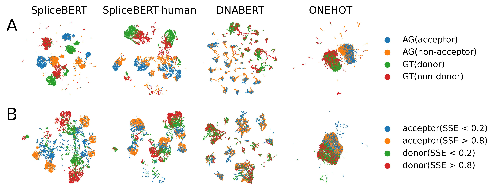

# SpliceBERT: precursor messenger RNA langauge model pre-trained on vertebrate pre-mRNAs

SpliceBERT ([manuscript](https://www.biorxiv.org/content/10.1101/2023.01.31.526427v1)) is a pre-mRNA sequence language model pre-trained on over 2 million vertebrate pre-mRNA sequences.
It can be used to study RNA splicing and other biological problems related to pre-mRNA sequence.




## How to use SpliceBERT?

SpliceBERT is implemented with [Huggingface](https://huggingface.co/docs/transformers/index) `transformers` library in PyTorch. Users should install pytorch and transformers to load the SpliceBERT model.  
- Install PyTorch: https://pytorch.org/get-started/locally/  
- Install Huggingface transformers: https://huggingface.co/docs/transformers/installation  

SpliceBERT can be easily used for a series of downstream tasks through the official API.
See [official guide](https://huggingface.co/docs/transformers/model_doc/bert) for more details.

examples:
```python
import torch
from transformers import AutoTokenizer, AutoModel, AutoModelForMaskedLM, AutoModelForTokenClassification

SPLICEBERT_PATH = "/path/to/SpliceBERT/model"

# load tokenizer
tokenizer = AutoTokenizer.from_pretrained(SPLICEBERT_PATH)

# prepare input sequence
seq = "ACGUACGuacguaCGu"  ## WARNING: this is just a demo. SpliceBERT may not work on sequences shorter than 64nt as it was trained on sequences of 64-1024nt in length
seq = ' '.join(list(seq.upper().replace("U", "T"))) # U -> T and add whitespace
input_ids = tokenizer.encode(seq) # warning: a [CLS] and a [SEP] token will be added to the start and the end of seq
input_ids = torch.as_tensor(input_ids)
input_ids = input_ids.unsqueeze(0) # add batch dimension


# get nucleotide embeddings (hidden states)
model = AutoModel.from_pretrained(SPLICEBERT_PATH) # load model
last_hidden_state = model(input_ids).last_hidden_state # get hidden states from last layer
hiddens_states = model(input_ids, output_hidden_states=True).hidden_states

# get logits from MLM
model = AutoModelForMaskedLM.from_pretrained(SPLICEBERT_PATH) # load model
logits = model(input_ids).logits

# load pre-trained SpliceBERT for token classification
model = AutoModelForTokenClassification.from_pretrained(SPLICEBERT_PATH, num_labels=3) # assume the class number is 3

# load pre-trained SpliceBERT for sequence classification
model = AutoModelForSequenceClassification.from_pretrained(SPLICEBERT_PATH, num_labels=3) # assume the class number is 3

```

## Reproduce the analysis in manuscript  
The codes to reproduce the analysis are available in [examples](./examples):  
- [evolutionary conservation analysis](./examples/00-conservation) (related to Figure 1)  
- [variant analysis](./examples/01-variant) (related to Figure 2)  
- [nucleotide embedding analysis](./examples/02-embedding) (related to Figure 3)  
- [attention weight analysis](./examples/03-attention) (related to Figure 4)  

Users could download all the data to run the codes from [zenodo]().
The following python packages or command line tools are also required to reproduce the results:  
- Python packages:
	- `transformers`  
	- `pytorch`  
	- `numpy`  
	- `scipy`  
	- `scikit-learn`  
	- `scanpy` (v1.9+ is required)  
	- `matplotlib`  
	- `tqdm`  
	- `pyBigWig` (optional)  
- Command line tools:  
	- `bedtools`  
	- `MaxEntScan` (optional)  
	- `gtfToGenePred` (optional)  

## Finetune SpliceBERT for splice sites/branchpoints prediction


## Contact
For issues related to the scripts, create an issue at https://github.com/biomed-AI/SpliceBERT/issues.

For any other questions, feel free to contact chenkenbio {at} gmail.com.

## Citation

```TeX
@article{Chen2023.01.31.526427,
	author = {Chen, Ken and Zhou, Yue and Ding, Maolin and Wang, Yu and Ren, Zhixiang and Yang, Yuedong},
	title = {Self-supervised learning on millions of pre-mRNA sequences improves sequence-based RNA splicing prediction},
	elocation-id = {2023.01.31.526427},
	year = {2023},
	doi = {10.1101/2023.01.31.526427},
	publisher = {Cold Spring Harbor Laboratory},
	URL = {https://www.biorxiv.org/content/early/2023/02/03/2023.01.31.526427},
	eprint = {https://www.biorxiv.org/content/early/2023/02/03/2023.01.31.526427.full.pdf},
	journal = {bioRxiv}
}
```
