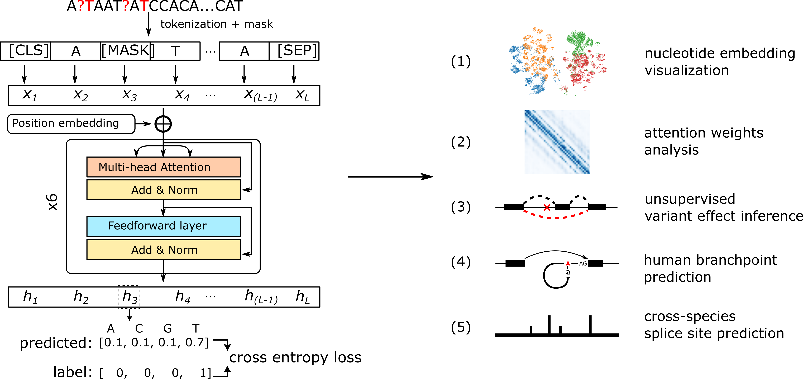

# SpliceBERT: RNA langauge model pre-trained on vertebrate primary RNA sequences

SpliceBERT ([manuscript](https://doi.org/10.1093/bib/bbae163), [preprint](https://www.biorxiv.org/content/10.1101/2023.01.31.526427v2)) is a primary RNA sequence language model pre-trained on over 2 million vertebrate RNA sequences.
It can be used to study RNA splicing and other biological problems related to RNA sequence.

**For additional benchmarks and applications of SpliceBERT (e.g., on SpliceAI's and DeepSTARR's datasets), see [SpliceBERT-analysis](https://github.com/chenkenbio/SpliceBERT-analysis).**



- [Data availability](#Data-availability)  
- [How to use SpliceBERT?](#how-to-use-splicebert)
- [Reproduce the analysis](#reproduce-the-analysis)
- [Contact](#contact)
- [Citation](#citation)


## Data availability
The model weights and data for analysis are available at [zenodo:7995778](https://doi.org/10.5281/zenodo.7995778).


## How to use SpliceBERT?

SpliceBERT is implemented with [Huggingface](https://huggingface.co/docs/transformers/index) `transformers` and [FlashAttention](https://github.com/Dao-AILab/flash-attention) in PyTorch. Users should install pytorch, transformers and FlashAttention (optional) to load the SpliceBERT model.  
- Install PyTorch: https://pytorch.org/get-started/locally/  
- Install Huggingface transformers: https://huggingface.co/docs/transformers/installation  
- Install FlashAttention (optional): https://github.com/Dao-AILab/flash-attention

SpliceBERT can be easily used for a series of downstream tasks through the official API.
See [official guide](https://huggingface.co/docs/transformers/model_doc/bert) for more details.

**Download SpliceBERT**

The weights of SpliceBERT can be downloaded from [zenodo](https://doi.org/10.5281/zenodo.7995778): https://zenodo.org/record/7995778/files/models.tar.gz?download=1

**System requirements**  

We recommend running SpliceBERT on a Linux system with a NVIDIA GPU of at least 4GB memory. (Running our model with only CPU is possible, but it will be very slow.)


**Examples**  
We provide a demo script to show how to use SpliceBERT though the official API of Huggingface transformers in the first part of the following code block.  
Users can also use SpliceBERT with FlashAttention by replacing the official API with the custom API, as shown in the second part of the following code block.
**Note that flash-attention requires automatic mixed precision (amp) mode to be enabled and currently it does not support [`attention_mask`](https://huggingface.co/docs/transformers/glossary#attention-mask)**

Use SpliceBERT though the official API of Huggingface transformers:
```python
SPLICEBERT_PATH = "/path/to/SpliceBERT/models/model_folder"  # set the path to the folder of pre-trained SpliceBERT
import torch
from transformers import AutoTokenizer, AutoModel, AutoModelForMaskedLM, AutoModelForTokenClassification

# load tokenizer
tokenizer = AutoTokenizer.from_pretrained(SPLICEBERT_PATH)

# prepare input sequence
seq = "ACGUACGuacguaCGu"  ## WARNING: this is just a demo. SpliceBERT may not work on sequences shorter than 64nt as it was trained on sequences of 64-1024nt in length
seq = ' '.join(list(seq.upper().replace("U", "T"))) # U -> T and add whitespace
input_ids = tokenizer.encode(seq) # N -> 5, A -> 6, C -> 7, G -> 8, T(U) -> 9. NOTE: a [CLS] and a [SEP] token will be added to the start and the end of seq
input_ids = torch.as_tensor(input_ids) # convert python list to Tensor
input_ids = input_ids.unsqueeze(0) # add batch dimension, shape: (batch_size, sequence_length)

# use huggerface's official API to use SpliceBERT
# get nucleotide embeddings (hidden states)
model = AutoModel.from_pretrained(SPLICEBERT_PATH) # load model
last_hidden_state = model(input_ids).last_hidden_state # get hidden states from last layer
hiddens_states = model(input_ids, output_hidden_states=True).hidden_states # hidden states from the embedding layer (nn.Embedding) and the 6 transformer encoder layers

# get nucleotide type logits in masked language modeling
model = AutoModelForMaskedLM.from_pretrained(SPLICEBERT_PATH) # load model
logits = model(input_ids).logits # shape: (batch_size, sequence_length, vocab_size)

# finetuning SpliceBERT for token classification tasks
model = AutoModelForTokenClassification.from_pretrained(SPLICEBERT_PATH, num_labels=3) # assume the class number is 3, shape: (batch_size, sequence_length, num_labels)

# finetuning SpliceBERT for sequence classification tasks
model = AutoModelForSequenceClassification.from_pretrained(SPLICEBERT_PATH, num_labels=3) # assume the class number is 3, shape: (batch_size, sequence_length, num_labels)
```

Or use SpliceBERT with FlashAttention by replacing the official API with the custom API (Currently flash-attention does not support attention_mask. As a result, the length of sequences in each batch should be the same)    
```python
SPLICEBERT_PATH = "/path/to/SpliceBERT/models/model_folder"  # set the path to the folder of pre-trained SpliceBERT
import torch
import sys
sys.path.append(os.path.dirname(os.path.abspath(SPICEBERT_PATH)))
from transformers import AutoTokenizer
from splicebert_model import BertModel, BertForMaskedLM, BertForTokenClassification

# load tokenizer
tokenizer = AutoTokenizer.from_pretrained(SPLICEBERT_PATH)

# prepare input sequence
seq = "ACGUACGuacguaCGu"  ## WARNING: this is just a demo. SpliceBERT may not work on sequences shorter than 64nt as it was trained on sequences of 64-1024nt in length
seq = ' '.join(list(seq.upper().replace("U", "T"))) # U -> T and add whitespace
input_ids = tokenizer.encode(seq) # N -> 5, A -> 6, C -> 7, G -> 8, T(U) -> 9. NOTE: a [CLS] and a [SEP] token will be added to the start and the end of seq
input_ids = torch.as_tensor(input_ids) # convert python list to Tensor
input_ids = input_ids.unsqueeze(0) # add batch dimension, shape: (batch_size, sequence_length)

# Or use custom BertModel with FlashAttention
# get nucleotide embeddings (hidden states)
model = BertModel.from_pretrained(SPLICEBERT_PATH) # load model
with autocast():
    last_hidden_state = model(input_ids).last_hidden_state # get hidden states from last layer
    hiddens_states = model(input_ids, output_hidden_states=True).hidden_states # hidden states from the embedding layer (nn.Embedding) and the 6 transformer encoder layers

# get nucleotide type logits in masked language modeling
model = BertForMaskedLM.from_pretrained(SPLICEBERT_PATH) # load model
with autocast():
    logits = model(input_ids).logits # shape: (batch_size, sequence_length, vocab_size)

# finetuning SpliceBERT for token classification tasks
with autocast():
    model = BertForTokenClassification.from_pretrained(SPLICEBERT_PATH, num_labels=3) # assume the class number is 3, shape: (batch_size, sequence_length, num_labels)

# finetuning SpliceBERT for sequence classification tasks
with autocast():
    model = BertForSequenceClassification.from_pretrained(SPLICEBERT_PATH, num_labels=3) # assume the class number is 3, shape: (batch_size, sequence_length, num_labels)
```


## Reproduce the analysis

1. Configure the environment. 

	We run the scripts in a conda environment with python 3.9.7 on a Linux system (Ubuntu 20.04.3 LTS).
	The required packages are:
	- Python packages:
		- `Python (3.9.7)`
		- `transformers (4.24.0)`  
		- `pytorch (1.12.1)`  
		- `h5py (3.2.1)`
		- `numpy (1.23.3)`  
		- `scipy (1.8.0)`  
		- `scikit-learn (1.1.1)`  
		- `scanpy (1.8.2)`
		- `matplotlib (3.5.1)`  
		- `seaborn (0.11.2)`
		- `tqdm (4.64.0)`  
		- `pyBigWig (0.3.18)`
		- `cython (0.29.28)`
	- Command line tools (optional):  
		- `bedtools (2.30.0)`  
		- `MaxEntScan (2004)`
		- `gtfToGenePred (v377)`

	*Note: the version number is only used to illustrate the version of softwares used in our study. In most cases, users do not need to ensure that the versions are strictly the same to ours to run the codes*

2. Clone this repository, download data and setup scripts.  
	```bash
	git clone git@github.com:biomed-AI/SpliceBERT.git
	cd SpliceBERT
	bash download.sh # download model weights and data, or manually download them from [zenodo](https://doi.org/10.5281/zenodo.7995778)
	cd examples
	bash setup.sh # compile selene utils, cython is required
	```

3. (Optional) Download pre-computed results for section 1-4 from [Google Drive](https://drive.google.com/file/d/1TCwbhyMiBP1bGEQcZj1qTH-Rif7Ee93P/view?usp=sharing) and decompress them in the `examples` folder.  
	```bash
	# users should manually download `pre-computed_results.tar.gz` and put it in the `./examples` folder and run the following command to decompress it
	tar -zxvf pre-computed_results.tar.gz
	```
	If pre-computed results have been downloaded and decompressed correctly, 
	users can skip running `pipeline.sh` in the jupyter notebooks of section 1-4.

4. Run jupyter notebooks (section 1-4) or bash scripts `pipeline.sh` (section 5-6):

	- [evolutionary conservation analysis](./examples/00-conservation) (related to Figure 1)  
	- [nucleotide embedding analysis](./examples/02-embedding) (related to Figure 2)  
	- [attention weight analysis](./examples/03-attention) (related to Figure 3)  
	- [variant effect analysis](./examples/01-variant) (related to Figure 4)  
	- [branchpoint prediction](./examples/05-bp-prediction) (related to Figure 5)
	- [splice site prediction](./examples/04-splicesite-prediction) (related to Figure 6)


## Contact
For issues related to the scripts, create an issue at https://github.com/biomed-AI/SpliceBERT/issues.

For any other questions, feel free to contact chenkenbio {at} gmail.com.

## Citation

```TeX
@article{Chen2023.01.31.526427,
	author = {Chen, Ken and Zhou, Yue and Ding, Maolin and Wang, Yu and Ren, Zhixiang and Yang, Yuedong},
	title = {Self-supervised learning on millions of primary RNA sequences from 72 vertebrates improves sequence-based RNA splicing prediction},
	year = {2024},
	doi = {10.1093/bib/bbae163},
	publisher = {Oxford University Press},
	URL = {https://doi.org/10.1093/bib/bbae163},
	journal = {Briefings in bioinformatics}
}
```
